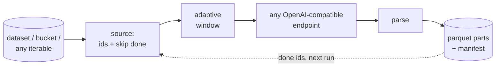
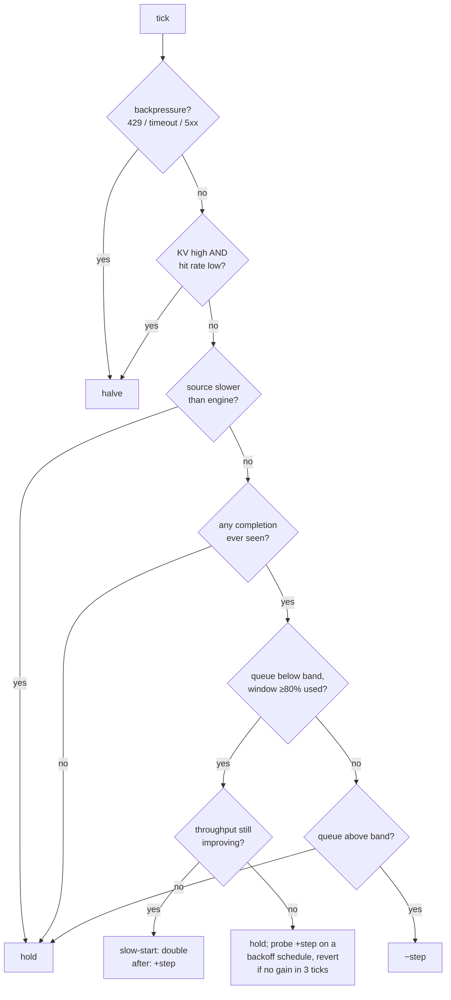

# Design

saturate exists for one loop: **data → model → nicer data** — run every row of a dataset
(or every file in a bucket) through a model and get a dataset back. This page gives the high-level shape
first, then how it is currently implemented. (Comparisons: [why.md](why.md) · on-disk
format: [../CONTRACT.md](../CONTRACT.md) · benchmark numbers:
[../spikes/RESULTS.md](../spikes/RESULTS.md).)

## The shape

Three pieces:

- **a row source** — any iterable of `(id, row)`; helpers exist for Hub datasets and
  buckets, but nothing requires them
- **an adaptive client** — keeps the endpoint busy without overloading it, by adjusting
  the number of in-flight requests at runtime
- **a storage contract** — the output is append-only parquet plus a manifest, so it is
  itself a dataset, and resume works by reading it back



The endpoint is anything that speaks the OpenAI HTTP API — vLLM, SGLang, llama.cpp,
TEI, an Inference Endpoint, a colleague's server. The library can boot a server for you
(`Engine`, a convenience) but never requires it: launch whatever you want, pass its URL.

Progress and resume live entirely in the output directory. A coordinator or UI can
watch a run by reading storage; it never needs to talk to the running process.

## The life of one row

```
source (any iterable / dataset_rows / bucket_rows)
  → id derivation (yours, or content-hash)          source.py
  → skip_done: anti-join against existing_ids()      source.py   ← resume happens HERE
  → admission: wait for a window slot                window.py
  → to_request(row) → HTTP POST (+retry ladder,      transport.py
      circuit breaker)
  → parse(row, response) → success or error record   core.py
  → buffered append → parquet part + manifest        sink.py
      sidecar (flush_every rows)
```

Failures become durable *error rows* (never gaps); a re-run skips done ids exactly and
can retry errored ones (`retry_errors=True`). A later success record for a previously
errored id is called healing; readers let the success win.

## How it is currently implemented

### Modules

| module | role |
|---|---|
| `controller.py` | pure `decide(obs, limit) -> new_limit`: `Fixed(n)` or `Auto` (below) |
| `window.py` | asyncio admission gate whose limit the controller adjusts at runtime |
| `signals.py` | `SignalSource`: engine `/metrics` scrape (vLLM/SGLang/llama.cpp/TEI dialects) or none |
| `transport.py` | typed `Request` (json ⊕ multipart), retry ladder, circuit breaker |
| `core.py` | `AdaptiveLimiter` (slot/observe) → `AdaptiveClient` (+HTTP) → `through()` (stream of `Done` results — id, row, output, error, timing) |
| `source.py` | `stream` (lazy normalize, content-hash ids), `skip_done` (anti-join + dedup), `shard_select` |
| `sources.py` | HF-native inputs (`[hf]` extra, lazy): `dataset_rows` (streaming Hub datasets), `bucket_rows` (raw objects by fsspec glob, bounded prefetch) |
| `sink.py` | Sink protocol: `ParquetSink` (full contract), `FileSink`; `drain`, `read_output` |
| `engine.py` | optional server lifecycle: boot templates, readiness gate, process-group kill |
| `telemetry.py` | per-tick records (CONTRACT §6) + run-end advisor |
| `__init__.py` | `pump()` = the composition of the above; `Stats`; agent-mode stdout contract |

### The controller (`Auto`)

Terms used below:

- **tick** — the controller runs on a ~2-second cadence; each tick it sees an `Obs`
  snapshot and returns the new window limit.
- **gauges** — engine-reported queue metrics scraped from `/metrics`: `waiting`
  (queued requests), `kv` (KV-cache utilization, 0–1), `hits` (prefix-cache hit
  rate). No gauges = **blind mode** (latency/error/throughput signals only).
- **band** — the target range for the engine's `waiting` queue:
  `[target_waiting/4, target_waiting*2]` (default target 8 → band [2, 16]). Small
  and positive: the engine always has work, never a runaway backlog.
- **delivered throughput** — tokens/sec actually completed this tick; the primary
  signal. Gauges speed decisions up; throughput decides them.

Per tick, first match wins:



| signal this tick | action | reason |
|---|---|---|
| backpressure (saturation-shaped 429 / timeout / 5xx) | halve the limit, short cooldown; cancel any in-flight probe | multiplicative decrease |
| KV high (≥0.9) AND prefix-hit rate low (<0.5) or absent | halve | high KV with healthy hits is cache reuse; with low hits it is memory pressure |
| source slower than engine (`input_bound`) | hold | a starved engine is ambiguous — never widen because the *source* lags |
| no request has ever completed | hold | with long generations, gauges show phantom headroom while preprocessing queues off-gauge; growing here is how jobs OOM |
| queue below band, ≥80% of window in flight, throughput improving | slow-start: double (until a queue has durably formed); after that: +step | grow while extra requests demonstrably become tokens |
| same, but throughput flat | hold, then probe +step on an exponential-backoff cooldown (4→32 ticks); keep it if throughput improves within 3 ticks, else revert | generations lag the tick, so one flat reading must not end growth forever |
| queue above band | −step | standing backlog: back off before the engine does |
| blind mode (no gauges) | +1 on sustained success unless throughput is flat | the fallback that carried the TEI and Inference Endpoints runs |

`Fixed(n)` bypasses all of it. Defaults: `Auto(target_waiting=8, initial=16,
max_limit=512, step=8)`; cap `max_limit` (~128) for vision workloads — in-flight
images live in host RAM.

### Seams

- **Transport** — a protocol; HTTP is the shipped implementation. An in-process
  vLLM/SGLang transport is the planned second one (high-rate, short-output regime).
  Proven bring-your-own: a binary-audio TTS transport was written against the
  documented surface without modifying the package (RESULTS.md, TTS probe).
- **SignalSource** — `/metrics` scrape or none; the controller only ever sees a plain
  `Obs` dict. The dialect table matches both metric-name spellings per engine because
  the k8s Gateway API Inference Extension (GAIE) protocol fixes gauge *semantics* but
  not their names (see [why.md §7](why.md)).
- **Sink** — one invariant: *an id returned by `existing_ids()` implies its record is
  durable; an id absent implies re-processing is safe.* `ParquetSink` carries the full
  CONTRACT; `FileSink` (one file per row, filesystem as manifest) is the second
  implementation; bring your own.
- **AdaptiveLimiter** — `slot()/observe(outcome)`: a drop-in replacement for a fixed
  semaphore in hosts that keep their own transport and IO (datatrove-shaped stacks).

### Invariants (tested)

Error rows, not lost rows · exactly-once admission per id (across runs via
manifest-first exact resume; within runs via dedup) · reserved columns `id`, `error`
always win over parse output · `error` is always string-typed · schema-invalid
responses are never marked success · the breaker can pause but never strand (waiters
always released; a server that stays down ends the run with an error) · stdout in
agent mode is exactly one JSON line.

### Known bounds (documented, not hidden)

Resume/dedup id-sets are in-memory (~10M rows comfortable; shard-scoped done-sets are
the planned fix beyond). Binary response routes (TTS audio) are not supported by the
built-in transport — use `AdaptiveLimiter` with your own transport. vLLM
pooling-model serving (embeddings) processes one batch per request, so embeddings
scale by fan-out, not by window. Frequent flushes to `hf://datasets/…` sinks mean
frequent commits — prefer buckets while a fan-out run is hot, publish to a dataset
repo at the end.
